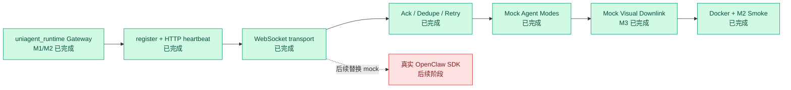

# Progress

## 中文进展规则

从 2026-05-21 起，每个实现 commit 后都必须追加中文进展，包含中文说明、验证方式和架构图状态变化。

## 当前架构完成状态

## 中文进展

| commit | 时间 | 中文进展 | 状态 |
|---|---|---|---|
| 8ca67cd | 2026-05-19 | 完成 Connector 侧 ack、去重和 envelope router，对齐 Gateway AckTracker 语义。 | 已完成 |
| ef9c9db | 2026-05-19 | 新增 mock agent stream，支持 happy、ack_drop、sequence_gap、slow、crash_after_started。 | 已完成 |
| 1070861 | 2026-05-20 | 新增 Docker 和 M2 smoke 脚本，覆盖 register、WS connect、mock request/response、ack timeout。 | 已完成 |
| 7e37c03 | 2026-05-20 | 加固 smoke ack timeout 路径，send 失败时返回 false，避免 WS 已关闭时崩溃。 | 已完成 |
| 748dca1 | 2026-05-20 | 处理 connection.replaced，旧 connector 收到替换后停止运行，不再和新连接抢注册。 | 已完成 |
| 183b47f | 2026-05-20 | 记录 M2 smoke 远端/本地验收结果，happy 和 ack_drop 核心路径通过。 | 已完成 |
| a625eed | 2026-05-21 | 扩展 mock agent 视觉下行：`happy` 默认返回 webchat 画面，新增 desktop 切换、generated image 和 no_visual 降级模式。 | 已完成 |
| 2c435eb | 2026-05-21 | 补齐 `agent.interrupt` 路由，Connector 收到 Gateway interrupt 后返回 ack，不再误判为 unknown type；mock visual frame 改为合法 JPEG，便于 SIP 下行占位渲染。 | 已完成 |

| commit | 时间 | 模块 | 修改文件 | 验证方式 |
|---|---|---|---|---|
| 5392e4a | 2026-05-19 | connector scaffold | package.json, tsconfig.json, src/config.ts 等 | npm run typecheck |
| 8e90733 | 2026-05-19 | connector HTTP | src/gatewayClient.ts, src/index.ts | npm run typecheck |
| 93ab7d4 | 2026-05-19 | connector WS | src/wsTransport.ts, src/index.ts | npm run build |
| b2940a6 | 2026-05-19 | DoD 修补: protocol | src/protocol.ts | npm run build |
| 05d41cd | 2026-05-19 | DoD 修补: logger | src/logger.ts, src/config.ts, src/index.ts, src/wsTransport.ts | npm run build |
| 47814a7 | 2026-05-19 | DoD 修补: ws transport | src/ws-client.ts, src/index.ts | npm run build |
| 921dec6 | 2026-05-19 | DoD 修补: reconnect | src/reconnect.ts | npm run build |
| 095a947 | 2026-05-19 | DoD 修补: runtime | src/runtime.ts, src/cli.ts, src/gateway-http-client.ts, package.json | npm run build |
| 8615ed6 | 2026-05-19 | DoD 修补: tests | tests/*.test.ts, src/runtime.ts | npm run build && npm test |
| 8ca67cd | 2026-05-19 | connector ack | src/ack-tracker.ts, src/dedupe-cache.ts, src/envelope-router.ts, tests/*ack* 等 | npm run build && npm test |
| ef9c9db | 2026-05-19 | connector mock agent | src/mock-agent.ts, src/stream-emitter.ts, src/sequence-generator.ts | npm run build && npm test |
| 1070861 | 2026-05-20 | connector docker smoke | Dockerfile, docker-compose.yml, scripts/m2_smoke.sh, README.md | npm run build && npm test && docker compose config; initial smoke blocked by Docker daemon |
| 7e37c03 | 2026-05-20 | smoke hardening | src/ack-tracker.ts, tests/ack-tracker.test.ts, scripts/m2_smoke.sh | npm run build && npm test |
| 748dca1 | 2026-05-20 | replacement handling | src/runtime.ts, tests/runtime.test.ts | npm run build && npm test |
| 183b47f | 2026-05-20 | M2 smoke verification | scripts/m2_smoke.sh | ./scripts/m2_smoke.sh -> M2 SMOKE OK |
| a625eed | 2026-05-21 | m3 visual mock | src/mock-agent.ts, src/protocol.ts, tests/mock-agent.test.ts, tests/protocol.test.ts | npm run build && npm test -> 51 passed |
| 2c435eb | 2026-05-21 | m3 interrupt support | src/envelope-router.ts, src/protocol.ts, src/mock-agent.ts, tests/envelope-router.test.ts | npm run build && npm test -> 52 passed |
